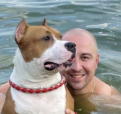

# Andrei Charheika

### Contacts:

* ###### Location: Minsk, Belarus
* ###### GitHub: https://github.com/2chera3
* ###### Discord: https://discordapp.com/users/2chera3/
* ###### e-mail: 2chera3@gmail.com

### Summary:

###### Hi 👋
###### I am a beginner JavaScript developer from Minsk.
###### I have more than 2 years of experience testing software as a QA Engineer on various platforms (web, mobile devices, tablets, 3D AR) and APIs.
###### I decided to change my specialty and study JavaScript on my own, becoming a future developer.
###### I love to travel, be active with my family and play with our dog Elvis.
> Viam supervadet vadens 🤞

### Skills:

* ###### Programming language: JavaScript, HTML (+CSS), SQL
* ###### Testing enviroment: Web, Mobile, Api, AR
* ###### Source control: Azure DevOps, Git (GitHub)
* ###### Bug tracking system: Jira
* ###### Test management: TestRail
* ###### OS: MacOS, Windows, Linux, iPadOS, iOS, Android
* ###### Tool: Chrome DevTools, Postman
* ###### Virtualization mechanism: Docker
* ###### Source code editor: Visual Studio Code
* ###### Accounting system: 1C: Accounting
* ###### Development methodology: Agile, Scrum, Waterfall

### Code example:

```
function showDistance (speed, time){
 alert (speed * time);
}
```

### Work experience:

##### Project: Manifest®
###### Manifest® digital work instruction software is enhanced with augmented reality, 3D models, audio, video, and PDF manuals making them an invaluable frontline worker aid for completing complex processes accurately and consistently.
###### Following tasks were performed: 
* ###### performed requirements analysis and testing;
* ###### performed functional and technical testing of specifications;
* ###### created and executed test cases;
* ###### performed results collection and analysis;
* ###### performed bug and test reporting;
* ###### performed project documentation maintenance;
* ###### updated test plan;
* ###### performed tasks planning (estimation);
* ###### reported sizing time for each releases;
* ###### trained and supervised junior team members;
* ###### conducted daily meetings (online+offline).

### Education:

* ###### Belarussian State Economic University (Economist-Manager)
* ###### IT-Academy (QA Manual)

### Languages:

* ###### Belarussian (Native)
* ###### Russian (Native)
* ###### English B1
* ###### Spanish A1

[](https://2chera3.github.io/rsschool-cv/cv)

[def]: andrei-cv.jpg